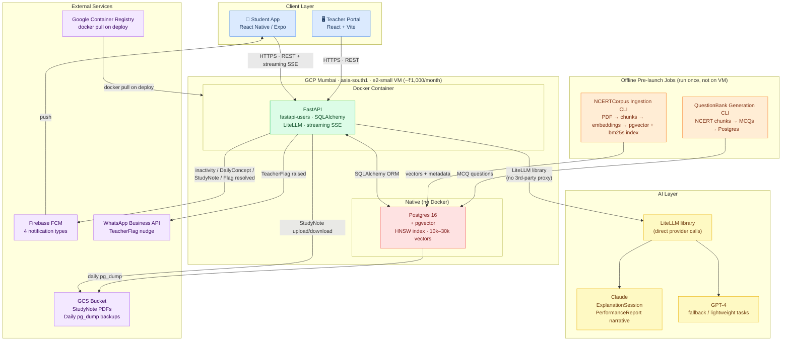

# Architecture



## Key decisions

| Decision | Choice | Reason |
|---|---|---|
| Backend | FastAPI | Async-native; first-class LLM streaming support |
| ORM | SQLAlchemy | Standard Python ORM; works with FastAPI |
| Auth | fastapi-users | Mobile number + password / OTP |
| LLM abstraction | LiteLLM (library) | Direct provider calls; no 3rd-party in student data path |
| Vector store | pgvector in Postgres | Corpus is small (10k–30k vectors); no extra service to operate |
| Student frontend | React Native / Expo | Mobile-first; interactive AI sessions |
| Teacher frontend | React + Vite | Desktop-optimized teacher/admin workflows |
| Infrastructure | GCP e2-small VM | ~₹1,000/month; DPDP data residency (Mumbai); migrates to Cloud Run via same Docker image |
| Teacher notifications | WhatsApp Business API | Higher open rate than SMS in India; disableable per-center |
| Push notifications | Firebase FCM | 4 types: DailyConcept, TeacherFlag resolved, StudyNote shared, inactivity reminder |
| Object storage | GCS | StudyNote PDFs (≤20MB) + daily DB backups |
| BM25 keyword index | bm25s (Python library) | True BM25 scoring; Postgres FTS rejected (non-standard scoring); Tantivy rejected (Rust build dependency, stale Python bindings) |
| Reranker | bge-reranker-base, plain PyTorch on CPU | ~400–800ms for top-20 on e2-small; ONNX INT8 and T4 GPU are documented upgrade paths |
```
